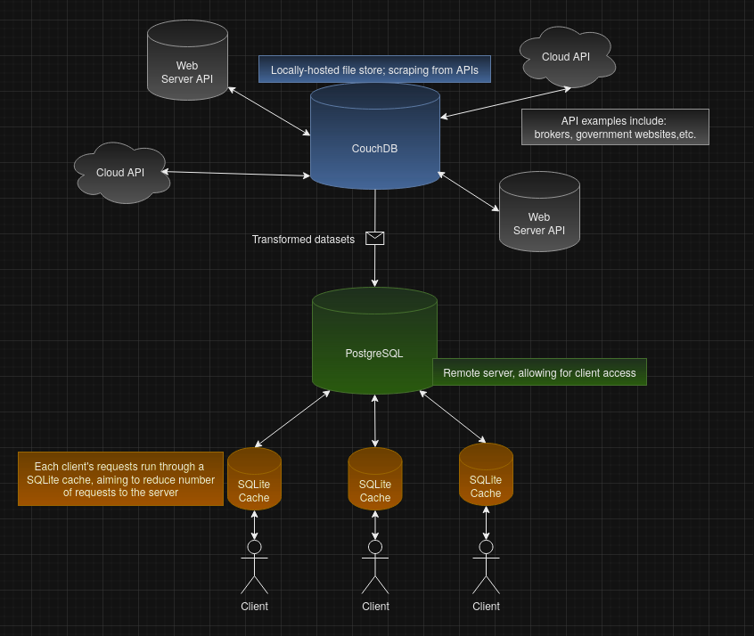

# Database Layout

Seperated into 2 entities (`Offline` & `Online`), the system structure allows for:
- fail-safes & simplified debugging (i.e., it's either a file system issue, or a network error)
- simplified cargo projects ([renai-fs] fetches data, whilst [renai-pg] migrates and handles online traffic)
- offline development that can easily feed to an online service

## CouchDB (version: 3.3.3) | *renai-fs*
> - `Offline` & locally-hosted .JSON files
> - Fetches and transforms data to simple layouts
> - More optimised for AI development (AI outputs can then be transferred to a Postgres table)

## PostgreSQL (version: 16.4) | *renai-pg*
> - `Online` & remote server
> - Heavily optimised schema design
> - Handles client requests

### Notes
> Client APIs also embed `SQLite3` for `caching`.